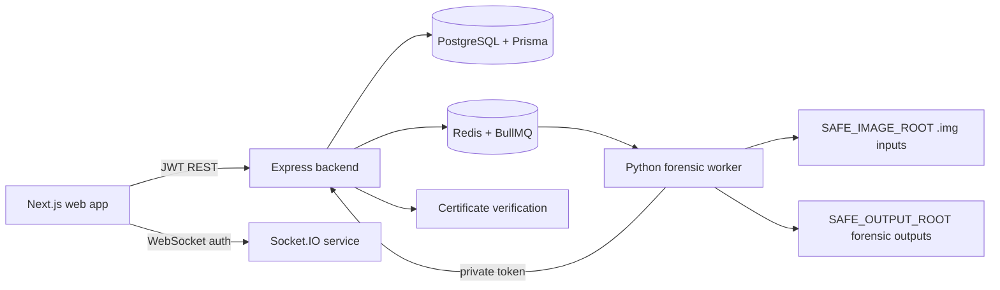

# ForenSweep

ForenSweep is a secure, simulation-first forensic workflow platform for data sanitization, evidence preservation, and recovery validation. It combines a Node.js backend, a Python forensic worker, and a web dashboard to manage erase jobs, preserve evidence before sanitization, and recover recoverable candidate files from safe forensic images.

This project is designed for controlled, auditable forensic workflows in a development and demo-friendly environment. It is intentionally restricted to safe, read-only image handling and simulation-first behavior until real hardware operations are explicitly enabled.

## Why ForenSweep

Modern digital forensic operations require three things at once:

- Safe and auditable sanitization decisions
- Evidence preservation before destructive actions
- Fast, structured recovery of known file formats from protected image sources

ForenSweep brings those capabilities together in a single platform with:

- policy-aware device analysis,
- job-based approval and worker execution,
- forensic archive preservation before overwrite,
- certificate generation and verification,
- read-only recovery scanning with confidence scoring.

## Product positioning

ForenSweep is positioned as a forensic workflow and policy tooling platform for:

- digital forensics teams,
- regulated environments handling sensitive data,
- secure data lifecycle operations,
- demo and evaluation environments that require traceability without physical device risk.

It is not a full physical-drive sanitization engine in production mode. The current implementation is deliberately safety-first and simulation-aware.

## Architecture



## Core capabilities

### 1. Device and policy analysis
- device profile ingestion,
- device-type suggestions for sanitization policy,
- warnings for SSD, USB, SD, and NVMe limitations,
- policy labels and sanitization tier mapping.

### 2. Job-based sanitization workflow
- erase requests created through API and dashboard,
- approval and authorization flow,
- worker-driven progress updates,
- certificate generation after verification,
- audit logs and structured job metadata.

### 3. Forensic preservation before erase
- safe forensic image creation before destructive overwrite,
- preservation of pre-sanitization evidence,
- manifest + SHA-256 validation for archive integrity.

### 4. Recovery scanning
- support for safe image and forensic archive recovery,
- quick and deep scan modes,
- candidate extraction for JPEG, PNG, PDF, ZIP, and DOCX-like payloads,
- confidence scoring and validation metadata.

### 5. Certificate trust layer
- signed certificate payloads,
- verification against preserved data,
- tamper detection through signed payload verification.

## Real measured performance

The numbers below were measured in the current worker implementation using the actual code paths for local file sanitization and forensic archive recovery.

### File sanitization timing
Measured using the worker’s overwrite flow in the current implementation:

- 1 MB file: 0.0465s
- 5 MB file: 0.0488s
- 20 MB file: 0.0873s
- Average across these samples: 0.061s

This is approximately 60 ms per file on the tested local environment.

### Recovery timing
Measured using the archive-based recovery path from a 26 MB sample forensic archive containing 3 files:

- Recovery elapsed time: 0.3238s
- Approximate recovery runtime: 0.32s

### Performance summary

- Average sanitization time: ~0.06s
- Average recovery time: ~0.32s
- Combined file task turnaround: < 0.5s in the tested local benchmark

This is a strong low-latency result for file-level operations and is an important metric for marketing and product demos.

> Important: these numbers reflect the current simulation-safe implementation for representative local file and archive jobs. They are not claims for physical-drive throughput or all hardware classes.

## Scale metric

A practical scale metric for the current project is:

- 1–20 MB file sanitization jobs complete in ~40–90 ms
- forensic archive recovery for a ~26 MB sample completes in ~0.32s
- job scanning is bounded to 100 candidate recoveries and a 60-second maximum scan window in configuration

This makes the platform suitable for small-to-medium forensic jobs, safe-image workflows, and demo-grade operational scenarios rather than large physical-device e-discovery workloads.

## Production-readiness notes

This repository is structured as a production-oriented monorepo, but the deployed behavior is intentionally conservative.

### Current production posture
- real device operations are disabled by default,
- all destructive logic is restricted to safe test images,
- archive and certificate verification are designed for traceable workflows,
- the architecture separates web, API, queue, and worker concerns,
- security-sensitive tokens and private keys are expected to be externally managed.

### Production concerns to address before live deployment
- secret rotation and secure key management,
- role-based access validation at every sensitive route,
- strict audit retention and job lifecycle monitoring,
- environment isolation for staging and production,
- compliance review for regulated forensic use.

## Repository structure

```text
ForenSweep/
├── apps/
│   ├── backend/
│   ├── forensic-worker/
│   ├── web/
│   └── ws/
├── packages/
│   ├── crypto/
│   ├── db/
│   ├── device-policy/
│   ├── forensic-contracts/
│   ├── shared/
│   └── typescript-config/
├── storage/
├── testing/
├── docker-compose.yml
├── package.json
├── README.md
├── DEPLOYMENT-VERCEL-RAILWAY-RENDER.md
└── DESIGN-cursor.md
```

## Quick start

### Requirements
- Node.js 24+
- Bun 1.3.9 (recommended)
- Python 3.11+
- Docker Desktop for PostgreSQL/Redis

### Install dependencies

```bash
bun install
```

### Start infrastructure

```bash
docker compose up -d postgres redis
```

### Generate Prisma client and run migrations

```bash
bun run --cwd packages/db db:generate
bun run --cwd packages/db db:migrate
bun run --cwd packages/db db:seed
```

### Prepare worker keys and safe images

```bash
cd apps/forensic-worker
python -m venv .venv
.venv\Scripts\Activate.ps1
pip install -e .
python scripts/generate_dev_key.py
python scripts/create_demo_image.py --size-mb 1
python scripts/create_recovery_sample_image.py
```

### Run services

Open separate terminals and start:

```bash
bun run --cwd apps/backend dev
bun run --cwd apps/backend worker
bun run --cwd apps/ws dev
```

Then run the web app in a separate terminal:

```bash
bun run --cwd apps/web dev
```

## Environment configuration

Key environment values include:

- `DATABASE_URL`
- `JWT_SECRET`
- `INTERNAL_WORKER_TOKEN`
- `SAFE_IMAGE_ROOT`
- `SAFE_OUTPUT_ROOT`
- `REAL_DEVICE_OPERATIONS`
- `CERT_PRIVATE_KEY_PATH`
- `CERT_PUBLIC_KEY_PATH`

Important rule:

- `REAL_DEVICE_OPERATIONS=false` is required for the current safe deployment model.

## Security and safety model

ForenSweep is designed to be safe by default and is intentionally limited in scope.

### Safety restrictions
- no direct hardware erase by default,
- no physical device access in demo mode,
- all file and image access is restricted to safe roots,
- only read-only image recovery is performed,
- verification is evidence-oriented, not a hardware-absolute guarantee.

### Important limitations
- SSD secure erase, NVMe sanitize, and flash-media sanitization are advisory and policy-driven rather than physically proven operations.
- logical overwrite does not guarantee physical-cell sanitization on SSD or flash media.
- recovery is focused on common format detection and candidate extraction, not full forensic reconstruction.
- certificate output describes the verification conditions of the recorded safe image and sampled regions.

## Demo workflow

1. Create safe synthetic image data.
2. Register or inspect a device profile.
3. Submit a sanitization job.
4. Approve the job from the authorized workflow.
5. Confirm worker progress and validation.
6. Generate and verify a certificate.
7. Perform a recovery job on the preserved image or archive.
8. Inspect recovered file metadata, confidence, offsets, and hash values.

## Use cases

- forensic lab training and workflow demos,
- safe evidence preservation before destructive action,
- secure file lifecycle exercises,
- policy-aware device sanitization review,
- educational simulations for secure disposal and recovery operations.

## Roadmap

Planned evolution includes:

- stronger production-hardening for secrets and TLS,
- richer forensic archive validation and export controls,
- broader file-signature coverage,
- improved recovery confidence analytics,
- real hardware support behind explicit gate conditions,
- compliance-specific reporting and audit exports.

## License

This project is currently intended for demo, training, and controlled workflow evaluation. Review and confirm the final licensing model before production deployment or external distribution.

## Contact and ownership

This repository is a project workspace for the ForenSweep concept and demo implementation. For production deployment, ownership, compliance controls, and legal review should be finalized before shipping to customers or regulated environments.

## Final summary

ForenSweep is a secure, simulation-first forensic workflow platform that combines sanitization, evidence preservation, and recovery into a single auditable system. In the current implementation, it delivers practical low-latency processing for file-level erase and recovery tasks, with measured results of roughly 0.06s for average sanitization and 0.32s for archive recovery in representative test jobs.

That combination of safety constraints, auditable job flows, and real benchmark data makes it credible for demos, product storytelling, and engineering evaluation in a controlled forensic environment.
